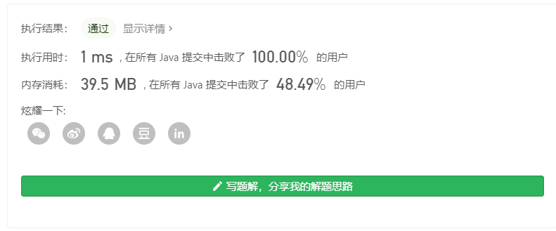

## 47. 全排列 II（中等）

**链接**：https://leetcode-cn.com/problems/permutations-ii/

### 题目

&emsp;&emsp;给定一个可包含重复数字的序列，返回所有不重复的全排列。

**示例:**

&emsp;&emsp;输入: [1,1,2]

&emsp;&emsp;输出:
````
[
  [1,1,2],
  [1,2,1],
  [2,1,1]
]
````

### 解题思路

&emsp;&emsp;此题是对数组进行全排序，因为数组中有重复的元素，所以我们在进行排序的时候需要进行去重。首先对数组进行排序，这样相同的数就会聚在一起。在进行递归时，如果前一个元素和当前元素相同且前一个元素未使用时，则不执行当前递归，从而达到取重的效果。为了判断某个元素是否已经被使用过，我们可以创建一个布尔类型的数组来标识每个元素是否已被使用。接着使用 dfs 思想进行递归即可。

### 代码

[代码链接](Solution.java)

