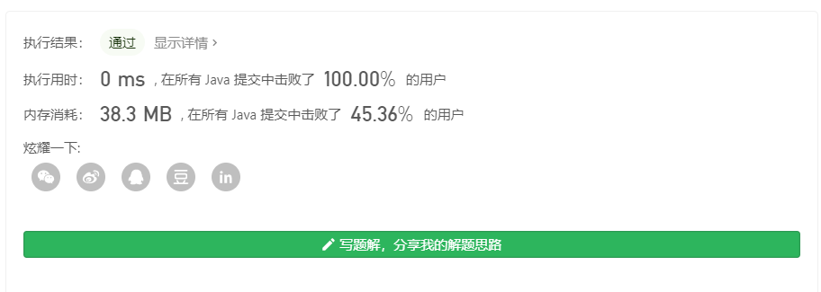

## 75. 颜色分类（中等）

**链接**：https://leetcode-cn.com/problems/sort-colors/

### 题目

&emsp;&emsp;给定一个包含红色、白色和蓝色，一共 n 个元素的数组，原地对它们进行排序，使得相同颜色的元素相邻，并按照红色、白色、蓝色顺序排列。

&emsp;&emsp;此题中，我们使用整数 0、 1 和 2 分别表示红色、白色和蓝色。

**注意:**

&emsp;&emsp;不能使用代码库中的排序函数来解决这道题。

**示例:**

&emsp;&emsp;输入: [2,0,2,1,1,0]

&emsp;&emsp;输出: [0,0,1,1,2,2]

**进阶：**

* 一个直观的解决方案是使用计数排序的两趟扫描算法。
首先，迭代计算出0、1 和 2 元素的个数，然后按照0、1、2的排序，重写当前数组。
* 你能想出一个仅使用常数空间的一趟扫描算法吗？

### 解题思路

&emsp;&emsp;我们用三个指针（p0, p2 和 p）来分别追踪0的最右边界，2的最左边界和当前元素。

&emsp;&emsp;解法思路是使用p指针遍历数组，直到 p <= p2 结束。

* 若 nums[curr] = 0 ：交换第curr个和第p0个元素，并将两个指针都向右移。
* 若 nums[curr] = 2 ：交换第curr个和第p2个元素，并将p2指针左移 。
* 若 nums[curr] = 1 ：将指针curr右移。

### 代码

[代码链接](Solution.java)

