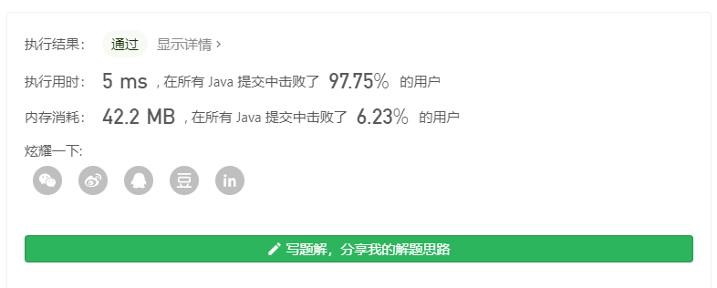

## 79. 单词搜索（中等）

**链接**：https://leetcode-cn.com/problems/word-search/

### 题目

&emsp;&emsp;给定一个二维网格和一个单词，找出该单词是否存在于网格中。

&emsp;&emsp;单词必须按照字母顺序，通过相邻的单元格内的字母构成，其中“相邻”单元格是那些水平相邻或垂直相邻的单元格。同一个单元格内的字母不允许被重复使用。

**示例:**

````
board =
[
  ['A','B','C','E'],
  ['S','F','C','S'],
  ['A','D','E','E']
]

给定 word = "ABCCED", 返回 true
给定 word = "SEE", 返回 true
给定 word = "ABCB", 返回 false
````
**提示：**

* board 和 word 中只包含大写和小写英文字母。
* 1 <= board.length <= 200
* 1 <= board[i].length <= 200
* 1 <= word.length <= 10^3

### 解题思路

&emsp;&emsp;在二维数组中查找一个单词，遍历数组找到单词的头部，然后向上下左右进行查找下一个字符，利用dfs的思想递归查找下一个字符，直到查找到最后一个字符为止。题目要求：同一个单元格内的字母不允许被重复使用，所以对使用过的字符进行标记即可。（注意下标越界）


### 代码

[代码链接](Solution.java)



